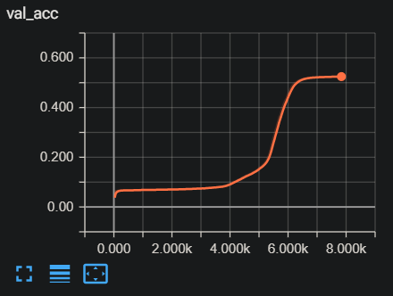

# Reformer-pytorch
Implements [Reformer: The Efficient Transformer](https://openreview.net/forum?id=rkgNKkHtvB) in pytorch. (Work in progress)

## Prerequisites

- Tested with Python 3.7.5, Pytorch 1.4.0.
- This code is built upon the [pytorch-lightning](https://github.com/williamFalcon/pytorch-lightning/) framework.
- `pip install -r requirements.txt`

## How to train

### Datasets

- If you want to modify `trainer.py` or `model\model.py`, it is recommended that you familiarize with youself the `pytorch-lightning` library beforehand.
- A custom copy task & music dataset has been implemented under `datasets\dataloader.py`. Modify as needed.
- A config yaml file must be placed under `config`. See provided yaml files for basic framework.

### Running the code

- `python3 trainer.py -c \path\to\config\yaml -n [name of run] -b [batch size] -f [fast dev run] -v [version number]`
- The `-f` flag is used for debugging; only one batch of training, validation, and testing will be calculated.
- The `-v` flag is used for resuming from checkpoints; leave empty for new version.
- A toy copy task of length 32, vocab 128 converges around ~6k steps using a batch size of 1024, learning rate of 1e-3 and Adam. The checkpoint is located under `checkpoints\`.

## How to sample

### Preparing the checkpoints

- A complete checkpoint folder must be placed under `logs\`. Use the entire folder pytorch-lightning automatically saves.

### Running the code

- A corresponding version number must be provided with a `-v` flag.
- Run the code with the `-s` flag set to `True`. This will generate 1 sample under `sample\`, if using the music dataset.

## To-do

- [x] Implement general framework of Reformer
- [x] Rewrite using [pytorch-lightning](https://github.com/williamFalcon/pytorch-lightning/) framework
- [x] Implement Label Smoothing
- [x] Implement LSH attention
- [x] Implement reversible layer
- [x] Implement autoregressive sampling
- [ ] Implement various datasets

## Implementation Authors

- [June Young Yi](<https://github.com/Rick-McCoy>) @ MINDsLab Inc. (julianyi1@snu.ac.kr, julianyi1@mindslab.ai)

## License

MIT License

## Acknowlegdements

- The general structure of this code is based on [The Annotated Transformer](http://nlp.seas.harvard.edu/2018/04/03/attention.html), albeit heavily modified.
- I am aware that [reformer-lm](https://github.com/zbloss/reformer_lm) exists. However, I was frustrated with the original [trax implementation](https://github.com/google/trax/blob/master/trax/models/research/reformer.py) that the authors provided, and decided to rewrite the entire thing from the ground up. Naturally, expect bugs everywhere.
- Thanks to [MINDsLab](<https://mindslab.ai>) for providing training resources.
